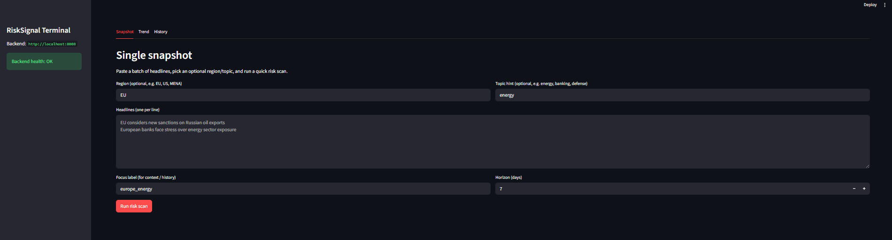
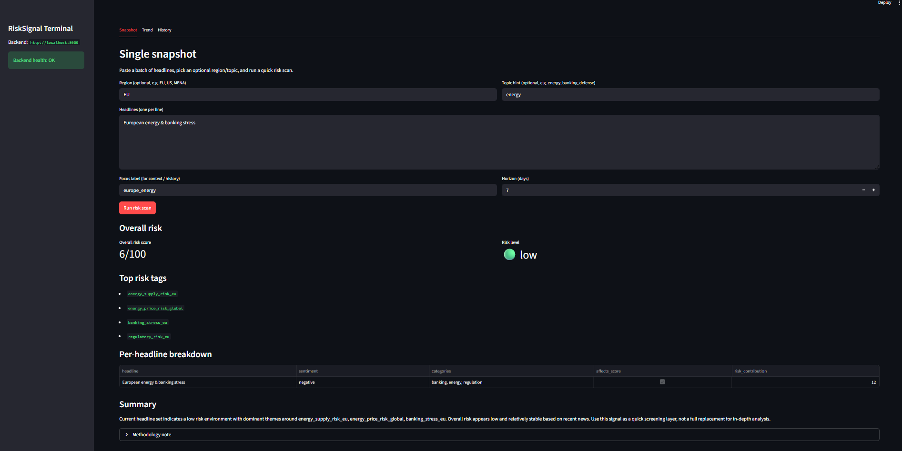
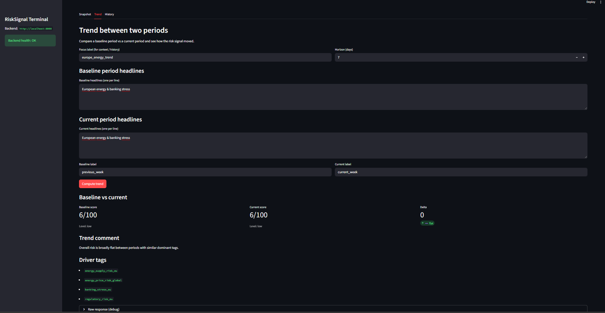
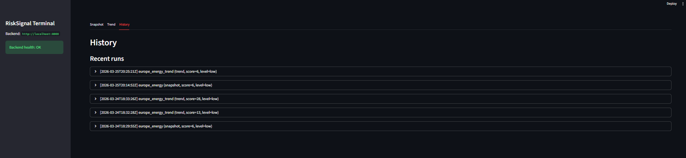

# RiskSignal API

RiskSignal API is a lightweight news-based risk signal service for macro, EM and sector analysts.  
It ingests batches of headlines and returns an overall risk score, granular risk tags and a simple trend view between two periods.

---

## Features

- **Batch risk scoring** – compute an overall 0–100 risk score from a set of news headlines.
- **Risk level bands** – map the score into low / medium / high bands for quick interpretation.
- **Granular risk tags** – generate specific tags such as `regulatory_risk_eu`, `sanctions_risk_russia`, `banking_stress_us`.
- **Trend analysis** – compare two periods (e.g. previous vs current week) and get direction, delta and main risk drivers.
- **FastAPI + Docker** – simple, portable microservice that can run locally or on platforms like Railway.

---

## API Overview

### 1. `POST /risk-signal`

Compute a risk signal for a single batch of news.

**Request body**
```json
{
  "items": [
    {
      "headline": "EU considers new sanctions on Russian oil exports",
      "body": "Officials are debating additional sanctions on selected Russian oil shipments.",
      "source": "Reuters",
      "published_at": "2026-03-22T10:00:00Z",
      "region": "EU",
      "topic_hint": "energy"
    },
    {
      "headline": "European banks face stress over energy sector exposure",
      "body": "Several EU banks flagged for increased risk due to concentrated energy lending.",
      "source": "FT",
      "published_at": "2026-03-22T09:00:00Z",
      "region": "EU",
      "topic_hint": "banking"
    }
  ],
  "focus": "energy",
  "horizon_days": 7
}
```

## RiskSignal Terminal (Streamlit)

RiskSignal Terminal is a simple analyst-facing UI on top of the RiskSignal API.  
It is designed for macro, EM and sector risk teams who want to quickly scan news headlines, see a risk score, and track how risk moves between periods without touching Python code.

---

### Tabs Overview

**Snapshot**

- Paste a batch of headlines (one per line) and optionally set `region` and `topic_hint`.
- The app calls `POST /risk-signal` and displays:
  - Overall risk score (0–100) and risk level (low / medium / high).
  - Top granular risk tags (e.g. `regulatory_risk_eu`, `sanctions_risk_russia`, `banking_stress_eu`).
  - Per-headline breakdown with sentiment, categories and risk contribution.
  - A short textual summary and methodology note.

**Trend**

- Paste baseline and current period headlines to compare two time windows (e.g. previous vs current week).
- The app calls `POST /risk-signal/trend` and shows:
  - Baseline vs current scores and levels.
  - Delta: score change, direction (up / down / flat) and a human-readable comment.
  - Driver tags – granular tags that explain what moved the signal between periods.

**History**

- Every Snapshot and Trend run is logged to a local SQLite database.
- The History tab shows:
  - Recent runs with timestamp, context label, run type (snapshot / trend), score and level.
  - Top tags for each run.
  - Full request/response JSON on click for quick debugging or export.

---

### How to Run the Terminal Locally

**1. Start the FastAPI backend** (in one terminal):
```bash
uvicorn main:app --reload --host 0.0.0.0 --port 8000
```

**2. In a separate terminal, create and activate a virtual environment** (if not already done):
```bash
python -m venv .venv

# Windows (PowerShell):
.\.venv\Scripts\Activate.ps1

# Windows (Command Prompt):
.\.venv\Scripts\activate.bat

# macOS / Linux:
source .venv/bin/activate
```

**3. Install frontend dependencies:**
```bash
pip install -r requirements.txt
```

Ensure `streamlit` and `requests` are included in `requirements.txt`.

**4. Run the Streamlit app:**
```bash
streamlit run frontend_app.py
```

**5. Open the browser:**

- Terminal UI: http://localhost:8501
- Backend docs: http://localhost:8000/docs
- Backend health: http://localhost:8000/health

By default, the frontend talks to the backend at `http://localhost:8000`. You can override this by setting `RISKSIGNAL_API_URL` in your environment.

## RiskSignal Terminal (Streamlit)

RiskSignal Terminal is a lightweight Streamlit interface on top of the RiskSignal API. It is designed for macro analysts, portfolio managers, and risk teams who need a fast view of regime shifts in macro, market and geopolitical risk for specific themes.

### Screenshots

- **Terminal – Dashboard**

  

- **Terminal – Snapshot (European energy & banking stress)**

  

- **Terminal – Trend (European energy & banking stress)**

  

- **Terminal – History**

  

### How to run locally

1. Start the FastAPI backend:

   ```bash
   uvicorn main:app --reload
   # API available at http://localhost:8000
   ```

2. Set the API URL for the Terminal (for example via environment variable):

   ```bash
   set RISKSIGNAL_API_URL=http://localhost:8000  # Windows (PowerShell/CMD)
   # or
   export RISKSIGNAL_API_URL=http://localhost:8000  # macOS / Linux
   ```

3. Start the Streamlit Terminal:

   ```bash
   python -m streamlit run frontend_app.py
   ```

4. Open the URL printed by Streamlit (usually `http://localhost:8501`) in your browser. The Terminal will talk to the local RiskSignal API via `RISKSIGNAL_API_URL`.

---

### Sample Scenarios

**Scenario 1 – `europe_energy`**

- **Baseline:** headlines about early discussions of EU sanctions on Russian oil and mixed signals from banks.
- **Current:** headlines about a fully approved sanctions package and early signs of banking stress from energy exposure.
- **What you see:**
  - Snapshot: medium risk score with tags like `energy_supply_risk_eu`, `energy_price_risk_global`, `banking_stress_eu`.
  - Trend: risk moving up between weeks, with a comment highlighting sanctions and banking stress as main drivers.

**Scenario 2 – `banking_stress`**

- **Baseline:** "Banks remain stable despite energy market volatility."
- **Current:** "European banks face stress over energy exposure", "Regulators warn about rising banking stress."
- **What you see:**
  - Snapshot: low-to-medium score focused on `banking_stress_eu` and `regulatory_risk_eu`.
  - Trend: clear "up" move in the score, driven by banking stress and regulatory risk tags.

## Case Study

See `CASE_STUDY.md` for a simple example on **European energy & banking stress** using the Trend view in the RiskSignal Terminal.

### How Analysts Can Use This Day-to-Day

- Drop in the latest headlines from your news terminal (Reuters, FT, Bloomberg) to get a fast, explainable risk signal before meetings or risk committees.
- Use the **Trend** tab to compare "last week vs this week" for specific themes (e.g. Russia sanctions, EU energy, US regional banks) and quickly understand what moved.
- Use the **History** tab as a lightweight log of past runs, tagged by focus label (e.g. `europe_energy_week_12_2026`), so you can revisit how the signal behaved around key events without rebuilding queries from scratch.

**Response body (example)**
```json
{
  "overall_risk_score": 38,
  "risk_level": "medium",
  "top_risk_tags": [
    "regulatory_risk_eu",
    "banking_stress_eu",
    "energy_supply_risk_eu"
  ],
  "summary": "Current headline set indicates a medium risk environment with dominant themes around regulatory_risk_eu, banking_stress_eu, energy_supply_risk_eu. Overall risk appears moderate and should be monitored based on recent news. Use this signal as a quick screening layer, not a full replacement for in-depth analysis.",
  "methodology_note": "This is a simple v1 heuristic based on keyword matching and category weights. Each negative headline increases the score depending on its category, while positive news can slightly offset risk. The overall score is normalized to a 0–100 range and mapped to low/medium/high bands. This is not a statistical or machine learning model and should be treated as an early signal only.",
  "items": [
    {
      "headline": "EU considers new sanctions on Russian oil exports",
      "sentiment": "negative",
      "categories": ["sanctions", "energy"],
      "affects_score": true,
      "risk_contribution": 7
    },
    {
      "headline": "European banks face stress over energy sector exposure",
      "sentiment": "negative",
      "categories": ["banking", "energy"],
      "affects_score": true,
      "risk_contribution": 5
    }
  ]
}
```

---

### 2. `POST /risk-signal/trend`

Compare risk between two periods (e.g. previous week vs current week) and return the trend.

**Request body**
```json
{
  "baseline": {
    "period_label": "previous_week",
    "items": [
      {
        "headline": "EU signals possible sanctions on Russian oil exports",
        "body": "EU officials are debating initial sanctions targeting selected Russian oil shipments.",
        "source": "Reuters",
        "published_at": "2026-03-15T10:00:00Z",
        "region": "EU",
        "topic_hint": "energy"
      }
    ]
  },
  "current": {
    "period_label": "current_week",
    "items": [
      {
        "headline": "EU approves new sanctions package on Russian oil exports",
        "body": "A stronger round of sanctions on Russian oil is approved, hitting shipping and insurance.",
        "source": "Reuters",
        "published_at": "2026-03-22T10:00:00Z",
        "region": "EU",
        "topic_hint": "energy"
      },
      {
        "headline": "European banks face stress over energy exposure",
        "body": "Several EU banks flagged for increased risk due to concentrated energy-sector lending.",
        "source": "FT",
        "published_at": "2026-03-22T09:00:00Z",
        "region": "EU",
        "topic_hint": "banking"
      }
    ]
  },
  "focus": "energy",
  "horizon_days": 7
}
```

**Response body (example)**
```json
{
  "baseline": {
    "period_label": "previous_week",
    "overall_risk_score": 7,
    "risk_level": "low"
  },
  "current": {
    "period_label": "current_week",
    "overall_risk_score": 13,
    "risk_level": "low"
  },
  "delta": {
    "score_change": 6,
    "direction": "up",
    "comment": "Risk moved up by 6 points, driven mainly by regulatory_risk_eu, banking_stress_eu."
  },
  "driver_tags": [
    "regulatory_risk_eu",
    "banking_stress_eu"
  ],
  "methodology_note": "Trend is computed by running the existing heuristic on both periods and comparing scores."
}
```

---

### 3. `GET /health`

Simple healthcheck endpoint used for container orchestration and uptime checks.

**Response body**
```json
{
  "status": "ok"
}
```

---

## How to Run Locally

### 1. Install dependencies
```bash
python -m venv .venv
source .venv/bin/activate  # Windows: .venv\Scripts\activate
pip install -r requirements.txt
```

### 2. Run the API with Uvicorn
```bash
uvicorn main:app --reload --host 0.0.0.0 --port 8000
```

Then open:

- Swagger UI: http://127.0.0.1:8000/docs
- Healthcheck: http://127.0.0.1:8000/health

---

## Run with Docker

Build and run the container:
```bash
docker build -t risk-signal-api .
docker run -p 8000:8000 risk-signal-api
```

Or using Docker Compose:
```bash
docker compose up --build
```

Then open:

- http://127.0.0.1:8000/health
- http://127.0.0.1:8000/docs

---

## Potential Use Cases

**EM macro / FX desks**  
Monitoring sanctions, energy supply, and banking stress headlines for frontier and emerging markets.

**Bank treasury / ALM**  
Screening daily news for regulatory pressure, banking stress and macro risk signals that may impact liquidity or funding.

**Commodity and energy traders**  
Tracking energy-related risk tags such as `energy_supply_risk_eu` or `energy_price_risk_global` across time.

**Corporate risk & strategy teams**  
Running quick risk sweeps on specific topics (e.g. sanctions, regulation, trade disruptions) before investment committees or board meetings.

**Research / data teams**  
Using the API as a simple feature generator for more advanced machine learning models or dashboards.

---

## Deployment (Railway Example)

1. Push the repository to GitHub.
2. On Railway, create a new project → **New Service** → **Deploy from GitHub repo**.
3. Railway will detect the Dockerfile and build the image.
4. Set an environment variable in the Railway service:
```
PORT=8000
```

5. Ensure the container command binds to `0.0.0.0` using the `PORT` variable:
```bash
uvicorn main:app --host 0.0.0.0 --port ${PORT:-8000}
```

6. Deploy and open the generated public URL:
   - `/health` for health checks
   - `/docs` for interactive API docs

---

## Tech Stack

- Python 3.10+
- FastAPI
- Pydantic
- Uvicorn
- Docker